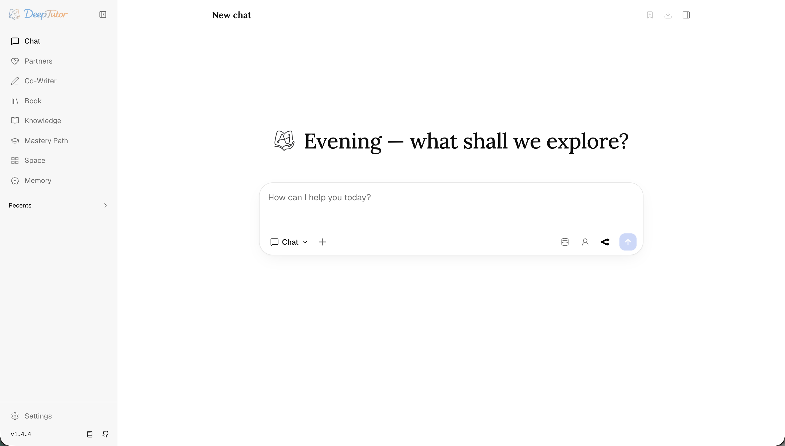
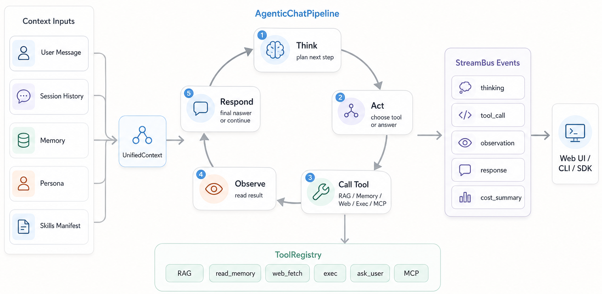
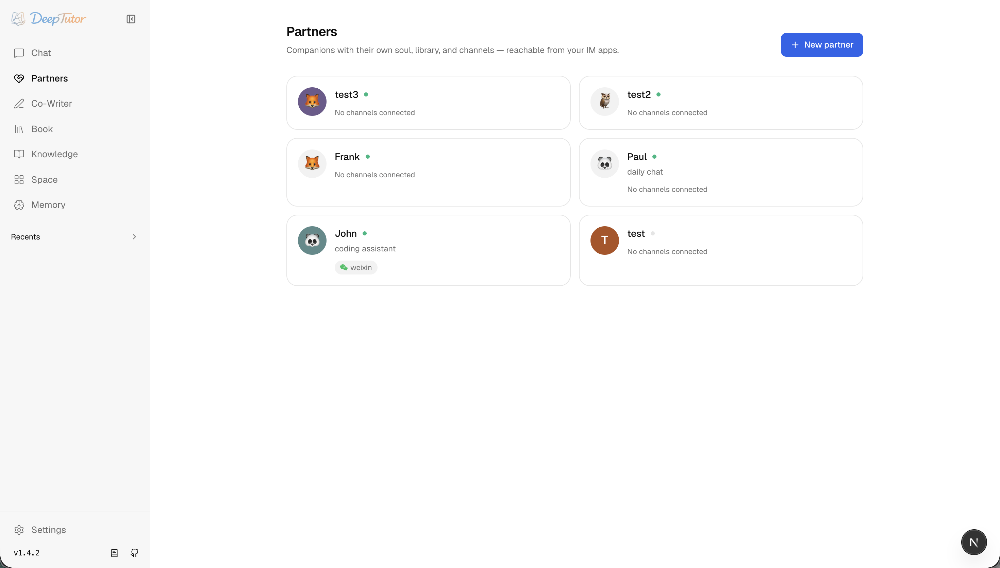
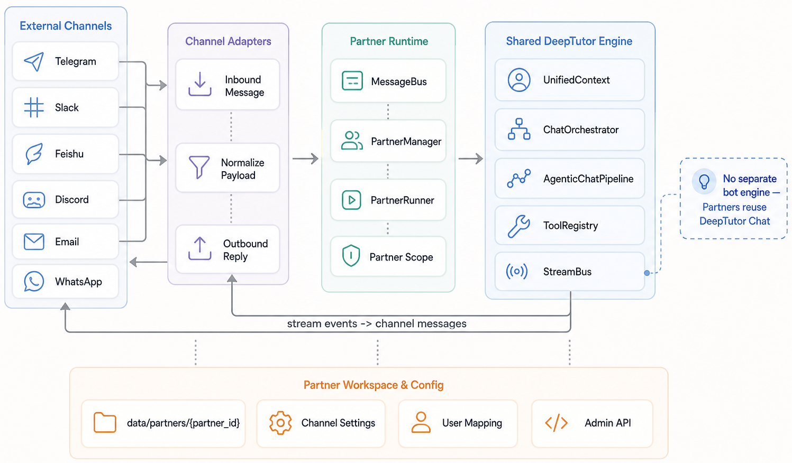
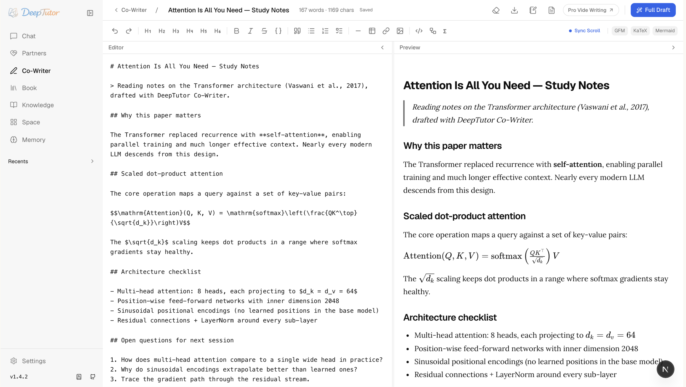
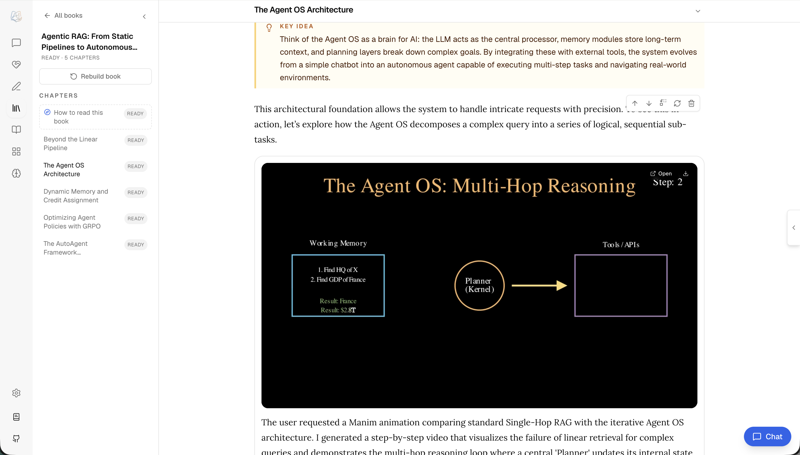
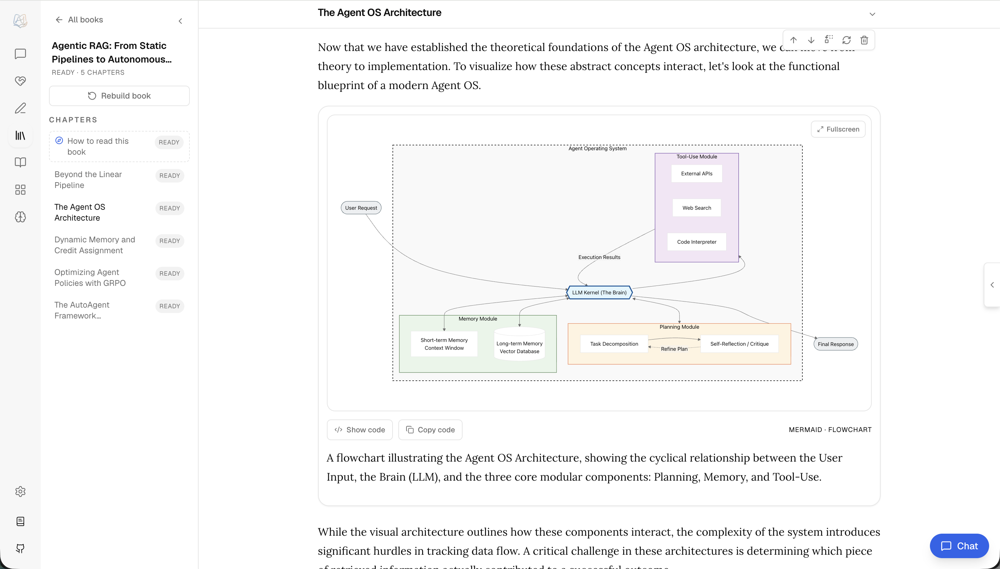
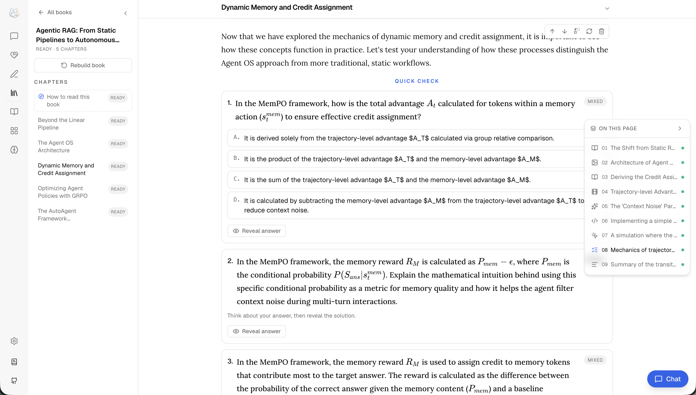

## 一键安装 / One-click Quickstart

```bash
bash install.sh
python3 scripts/doctor.py
python3 scripts/smoke.py
```

- `bash install.sh`：自动执行 setup + smoke，适合第一次使用。
- `python3 scripts/doctor.py`：检查环境、入口文件和产品门禁，失败时给出修复建议。
- `python3 scripts/smoke.py`：执行产品收敛门禁和轻量核心冒烟验证。

<div align="center">

<p align="center">&nbsp;</p>

# 他山之石 · HerPeakGem: Agent-Native Personalized Tutoring

<p align="center">
  <a href="https://herpeakgem.info" target="_blank"></a>
</p>

<p align="center">
  <a href="README_CN.md"></a>&nbsp;
  <a href="README.md"></a>
</p>

[](https://www.python.org/downloads/)
[](https://nextjs.org/)
[](LICENSE)
[](https://arxiv.org/abs/2604.26962)

[Features](#-key-features) · [Get Started](#-get-started) · [Explore](#-explore-herpeakgem) · [CLI](#-herpeakgem-cli--agent-native-interface) · [Ecosystem](#-ecosystem--open-to-the-skills-community) · [Community](#-community)

</div>

---

> 🤝 **We welcome contributions!** See our [Contributing Guide](CONTRIBUTING.md) for branching strategy, coding standards, and how to get started.

### 📦 Releases

> **[2026.6.18]** v1.4.8 — Connect your own **Partners** under **My Agents** and consult them live in chat (their persona, library and skills answer through their own loop), and every Partner gains a private memory via `partner_read` / `partner_memorize` / `partner_search`.

> **[2026.6.17]** v1.4.7 — Connect your local **Claude Code / Codex** and consult it live mid-turn, **My Agents** graduates to a top-level `/agents`, and Partner conversations gain branch / resume / delete with a replayable trace.

> **[2026.6.14]** v1.4.6 — Four-surface consolidation: a **Knowledge Center** with GraphRAG / PageIndex / LightRAG engines and linked-KB / Obsidian mounts, a Space learning dashboard with **My Agents** and top-level Memory, plus document parsing / voice / media settings.

> **[2026.6.13]** v1.4.5 — Guided Learning rebuilt on the chat agent loop with a hard per-type mastery gate and a `/learning` dashboard, a new loop-plugin framework, plus Markdown export for Partner conversations.

> **[2026.6.12]** v1.4.4 — Install community skills from [ClawHub](https://clawhub.ai/) with `herpeakgem skill install` behind a security gate, plus real in-browser DOCX/XLSX previews for knowledge-base files.

> **[2026.6.12]** v1.4.3 — TutorBot becomes **Partners** on a production-grade IM pipeline (15 channels, live streaming), Chat moves to a single agent loop, real per-user isolation, and a rebuilt Visualize.

### 📰 News

- **2026-05-22** 🌐 Official docs site live at [**herpeakgem.info**](https://herpeakgem.info/) — guides, references, and capability tours in one place.
- **2026-04-10** 📄 Our paper is live on arXiv — read the [preprint](https://arxiv.org/abs/2604.26962) for the design and ideas behind HerPeakGem.

## ✨ Key Features / 核心特性

HerPeakGem is an agent-native learning workspace that connects tutoring, problem solving, quiz generation, research, visualization, and mastery practice in one extensible system.

他山之石（HerPeakGem）是一个 Agent 原生的智能学习工作台，将辅导、解题、出题、研究、可视化和掌握练习整合在一个可扩展的系统中。

- **One runtime for every mode** — Chat, Solve, Quiz, Research, Visualize, and Mastery Path share the same tutoring engine, so context can move with the learner.
  **统一运行时** — 聊天、解题、出题、研究、可视化和学习路径共享同一个教学引擎，上下文随学习者流动。
- **Connected learning context** — Knowledge Bases, books, Co-Writer drafts, Space assets, notebooks, and Memory stay available across workflows instead of living in isolated tools.
  **连通的学习上下文** — 知识库、书籍、协作文档、空间资产、笔记本和记忆跨工作流可用，不再孤立。
- **Extensible tools and skills** — Built-in tools, MCP tools, built-in skills, and installable community skills let HerPeakGem grow with new learning workflows.
  **可扩展的工具和技能** — 内置工具、MCP 工具、内置技能和可安装的社区技能让 HerPeakGem 持续成长。
- **Inspectable memory** — L1 traces, L2 surface summaries, and L3 synthesis make personalization visible, editable, and grounded in prior activity.
  **可检查的记忆** — L1 追踪、L2 表面摘要和 L3 综合让个性化可见、可编辑、有据可依。
- **Persistent Partners** — IM-connected companions run on the same agent loop, each with its own soul, channels, workspace, and assigned library.
  **持久的伙伴** — IM 连接的学习伙伴运行在同一个 Agent 循环上，各自拥有独立的人格、频道、工作区和知识库。

---

## 🚀 Get Started / 快速开始

HerPeakGem ships four installation paths. They all share one workspace layout: settings live in `data/user/settings/` under the directory you launch from (or under `HERPEAKGEM_HOME` / `herpeakgem start --home` if you set one explicitly). For the full app, the recommended flow is **pick a workspace directory → install → `herpeakgem init` → `herpeakgem start`**.

### Option 1 — Install From PyPI / 从 PyPI 安装

```bash
mkdir -p my-herpeakgem && cd my-herpeakgem
pip install -U herpeakgem
herpeakgem init     # prompts for ports + LLM provider + optional embedding
herpeakgem start    # starts backend + frontend; keep the terminal open
```

After `herpeakgem start`, open the frontend URL printed in the terminal.

### Option 2 — Install From Source / 从源码安装

```bash
git clone https://github.com/503496348-ops/herpeakgem.git
cd HerPeakGem

python3 -m venv .venv && source .venv/bin/activate
python -m pip install --upgrade pip

python -m pip install -e .
( cd web && npm ci --legacy-peer-deps )

herpeakgem init
herpeakgem start
```

### Option 3 — Docker

```bash
docker run --rm --name herpeakgem \
  -p 127.0.0.1:3782:3782 \
  -p 127.0.0.1:8001:8001 \
  -v herpeakgem-data:/app/data \
  ghcr.io/atomcollide/herpeakgem:latest
```

### Option 4 — CLI Only / 仅 CLI

```bash
git clone https://github.com/503496348-ops/herpeakgem.git
cd HerPeakGem

python3 -m venv .venv-cli && source .venv-cli/bin/activate
python -m pip install --upgrade pip

python -m pip install -e ./packaging/herpeakgem-cli
herpeakgem init --cli
herpeakgem chat
```

## 📖 Explore HerPeakGem / 探索他山之石

Start with the main surfaces you will use day to day: Chat, Partners, Co-Writer, Book, Knowledge, Space, Memory, and Settings.

<div align="center">

</div>

<details>
<summary><b>💬 Chat — The Agent Loop / 聊天 — Agent 循环</b></summary>

Chat is the default capability and the place where most work begins. A single thread can talk normally, call tools, ground itself in selected knowledge bases, read attachments, write notebook records, and continue with the same source inventory across turns.

<div align="center">

</div>

</details>

<details>
<summary><b>🤝 Partner — Persistent Companions / 伙伴 — 持久的学习伴侣</b></summary>

<div align="center">

</div>

Partners replace the older TutorBot engine with a cleaner model: every inbound web or IM message becomes a normal ChatOrchestrator turn inside a partner-scoped workspace.

<div align="center">

</div>

</details>

<details>
<summary><b>✍️ Co-Writer — Markdown Drafting / 协作写作 — Markdown 草稿</b></summary>

<div align="center">

</div>

Co-Writer is a split-view Markdown workspace for reports, tutorials, notes, and long-form learning artifacts.

</details>

<details>
<summary><b>📖 Book — Living Books / 书籍 — 活的教材</b></summary>

<p align="center">

&nbsp;

&nbsp;

</p>

Book turns selected sources into interactive learning material.

</details>

<details>
<summary><b>📚 Knowledge — Versioned RAG Libraries / 知识库 — 版本化 RAG 库</b></summary>

<div align="center">

</div>

Knowledge Bases are the document collections behind RAG. The current stack is LlamaIndex-only, with a flat `version-N` storage layout keyed by embedding signature.

</details>

## 🏗️ HerPeakGem CLI — Agent-Native Interface

```bash
herpeakgem chat                                          # Interactive REPL
herpeakgem chat --capability deep_solve --tool rag --kb my-kb
herpeakgem run chat "Explain Fourier transform"
herpeakgem run deep_solve "Solve x^2 = 4" --tool rag --kb my-kb
herpeakgem kb create my-kb --doc textbook.pdf
herpeakgem memory show
herpeakgem config show
herpeakgem provider login openai-codex      # OAuth login
herpeakgem provider login github-copilot    # Validate existing GitHub Copilot auth
```

Provider auth (`openai-codex` OAuth login; `github-copilot` validates an existing Copilot auth session)

See [SKILL.md](SKILL.md) for the full CLI reference.

## 🌐 Ecosystem — Open to the Skills Community

HerPeakGem supports installable community skills from [ClawHub](https://clawhub.ai/):

```bash
herpeakgem skill search "flashcards"
herpeakgem skill install clawhub:flashcards
```

## 👥 Community

- [Discord](https://discord.gg/eRsjPgMU4t)
- [Contributing Guide](CONTRIBUTING.md)

## 📄 License

Apache-2.0 — see [LICENSE](LICENSE) for details.

## 📖 Citation / 引用

If you use this software, please cite it as below / 如果使用本软件，请按以下格式引用：

```bibtex
@article{zhao2026herpeakgem,
  title={DeepTutor: Towards Agentic Personalized Tutoring},
  author={Zhao, Bingxi and Zhang, Jiahao and Ren, Xubin and Guo, Zirui and Chu, Tianzhe and Ma, Yi and Huang, Chao},
  journal={arXiv preprint arXiv:2604.26962},
  year={2026}
}
```

---

> **Note:** HerPeakGem is built on the research foundation of [DeepTutor](https://arxiv.org/abs/2604.26962) by Zhao et al. (2026). All academic citations and references are preserved as-is.

---


---

## 🚀 加入AtomCollide-AI智能体实验室

**元素碰撞-AtomCollide-AI 智能体实验室** 是一个专注于AI领域的开源组织，汇聚了众多优秀学习者。

### 核心价值

**找工作：更省力，也更精准**
- 一线大厂内推通道（字节、阿里、腾讯等）
- 全链路求职赋能包（面试题库、简历优化、晋升指导）
- 线下技术沙龙 & 人脉网络

**学AI测试：真正落地，拒绝空谈**
- 从0到1实战落地体系（Skills、MCP、RAG、AI IDE等）
- 独家自研资料与工具矩阵
- 前沿技术同步与提效方案

### 知识库

- [踩坑合集](https://vcnvmnln7wit.feishu.cn/wiki/CjV9wG8IHiIpWikCdFEcxfErnne)
- [商业化案例库](https://vcnvmnln7wit.feishu.cn/wiki/LdIxwlrKGibFEVkWMocc2K9KnBh)
- [科普专栏](https://vcnvmnln7wit.feishu.cn/wiki/K1RPwM8zji9ZchkxlOmcivUgnJe)
- [Open Build](https://vcnvmnln7wit.feishu.cn/wiki/CThswol0PiNJJbkhgT1cZIxanLb)
- [LLM/Agent/研究报告知识库](https://vcnvmnln7wit.feishu.cn/wiki/KwGQwS2TciT2EdkSBBtcYnbsnSd)
- [Skill封装合集](https://vcnvmnln7wit.feishu.cn/wiki/PDfpwqJZUibTyBkUa7TcZZ6Onpd)
- [社区治理运营知识库](https://vcnvmnln7wit.feishu.cn/wiki/MSEGwrdnTiiF9Dk8qCVcNW6InJg)

### 加入社群

| 社群 | 链接 |
|------|------|
| AI探索交流1区 | [加入](https://applink.feishu.cn/client/chat/chatter/add_by_link?link_token=074vd565-6084-455c-ac52-9703e89a0697) |
| AI探索交流2区 | [加入](https://applink.feishu.cn/client/chat/chatter/add_by_link?link_token=60bj94f0-1a67-48a7-abbb-9172b161c2b0) |
| AI探索交流3区 | [加入](https://applink.feishu.cn/client/chat/chatter/add_by_link?link_token=13do1920-db46-4444-b635-005680beaf58) |
| AI探索交流4区 | [加入](https://applink.feishu.cn/client/chat/chatter/add_by_link?link_token=f17o1b86-06f6-4f10-911a-69a299a25fe3) |
| AI探索交流5区 | [加入](https://applink.feishu.cn/client/chat/chatter/add_by_link?link_token=2bbh6ab6-22c2-4753-b973-74bb1a2edcc9) |
| AI探索交流6区 | [加入](https://applink.feishu.cn/client/chat/chatter/add_by_link?link_token=d19r19f7-2f47-42ba-b1ec-cb0342cf2e80) |
| AI探索交流7区 | [加入](https://applink.feishu.cn/client/chat/chatter/add_by_link?link_token=fe9vdacc-7316-4b4d-ae4a-fdbcf56315e6) |
| AI探索交流8区 | [加入](https://applink.feishu.cn/client/chat/chatter/add_by_link?link_token=103kfae8-1fd7-424f-984f-d66c210e42d1) |
| AI探索交流9区 | [加入](https://applink.feishu.cn/client/chat/chatter/add_by_link?link_token=239p3cad-2f83-4baa-a230-f40386067548) |
| AI探索交流10区 | [加入](https://applink.feishu.cn/client/chat/chatter/add_by_link?link_token=880r7cf5-3638-45ff-afb9-7944de991872) |
| AI探索交流-网文作家 | [加入](https://applink.feishu.cn/client/chat/chatter/add_by_link?link_token=6a3v579b-ab43-4e1a-87f9-be63bab88da7) |
| AI探索交流群-音乐达人 | [加入](https://applink.feishu.cn/client/chat/chatter/add_by_link?link_token=76at299e-73da-4eeb-9eba-32161e98f2f8) |
| AI探索交流群-微笑驿站 | [加入](https://applink.feishu.cn/client/chat/chatter/add_by_link?link_token=f2av73d0-6bb4-4a9f-9095-5fbbe83e49ec) |

---

*AtomCollide-智械工坊团队出品*

---

## 组织与社群入口

**元素碰撞 · AtomCollide-AI 智能体实验室**：面向学习者、创作者与自动化实践者，持续沉淀可复用的 AI Agent 产品、工作流与工程经验。使命：**for the learner**。

> 请选择 1 个常用社群加入，内容全域同步，无需重复加入。

### 知识库

| 知识库 | 链接 |
|---|---|
| 踩坑合集 | [进入](https://vcnvmnln7wit.feishu.cn/wiki/CjV9wG8IHiIpWikCdFEcxfErnne) |
| 商业化案例库 | [进入](https://vcnvmnln7wit.feishu.cn/wiki/LdIxwlrKGibFEVkWMocc2K9KnBh) |
| 科普专栏 | [进入](https://vcnvmnln7wit.feishu.cn/wiki/K1RPwM8zji9ZchkxlOmcivUgnJe) |
| Open Build | [进入](https://vcnvmnln7wit.feishu.cn/wiki/CThswol0PiNJJbkhgT1cZIxanLb) |
| LLM / Agent / 研究报告 | [进入](https://vcnvmnln7wit.feishu.cn/wiki/KwGQwS2TciT2EdkSBBtcYnbsnSd) |
| Skill 封装合集 | [进入](https://vcnvmnln7wit.feishu.cn/wiki/PDfpwqJZUibTyBkUa7TcZZ6Onpd) |
| 社区治理运营 | [进入](https://vcnvmnln7wit.feishu.cn/wiki/MSEGwrdnTiiF9Dk8qCVcNW6InJg) |

### 社群邀请

| 社群 | 链接 |
|---|---|
| AI 探索交流 1 区 | [加入](https://applink.feishu.cn/client/chat/chatter/add_by_link?link_token=074vd565-6084-455c-ac52-9703e89a0697) |
| AI 探索交流 2 区 | [加入](https://applink.feishu.cn/client/chat/chatter/add_by_link?link_token=60bj94f0-1a67-48a7-abbb-9172b161c2b0) |
| AI 探索交流 3 区 | [加入](https://applink.feishu.cn/client/chat/chatter/add_by_link?link_token=13do1920-db46-4444-b635-005680beaf58) |
| AI 探索交流 4 区 | [加入](https://applink.feishu.cn/client/chat/chatter/add_by_link?link_token=f17o1b86-06f6-4f10-911a-69a299a25fe3) |
| AI 探索交流 5 区 | [加入](https://applink.feishu.cn/client/chat/chatter/add_by_link?link_token=2bbh6ab6-22c2-4753-b973-74bb1a2edcc9) |
| AI 探索交流 6 区 | [加入](https://applink.feishu.cn/client/chat/chatter/add_by_link?link_token=d19r19f7-2f47-42ba-b1ec-cb0342cf2e80) |
| AI 探索交流 7 区 | [加入](https://applink.feishu.cn/client/chat/chatter/add_by_link?link_token=fe9vdacc-7316-4b4d-ae4a-fdbcf56315e6) |
| AI 探索交流 8 区 | [加入](https://applink.feishu.cn/client/chat/chatter/add_by_link?link_token=103kfae8-1fd7-424f-984f-d66c210e42d1) |
| AI 探索交流 9 区 | [加入](https://applink.feishu.cn/client/chat/chatter/add_by_link?link_token=239p3cad-2f83-4baa-a230-f40386067548) |
| AI 探索交流 10 区 | [加入](https://applink.feishu.cn/client/chat/chatter/add_by_link?link_token=880r7cf5-3638-45ff-afb9-7944de991872) |
| AI 探索交流 — 网文作家 | [加入](https://applink.feishu.cn/client/chat/chatter/add_by_link?link_token=6a3v579b-ab43-4e1a-87f9-be63bab88da7) |
| AI 探索交流群 — 音乐达人 | [加入](https://applink.feishu.cn/client/chat/chatter/add_by_link?link_token=76at299e-73da-4eeb-9eba-32161e98f2f8) |
| AI 探索交流群 — 微笑驿站 | [加入](https://applink.feishu.cn/client/chat/chatter/add_by_link?link_token=f2av73d0-6bb4-4a9f-9095-5fbbe83e49ec) |

---

AtomCollide-智械工坊团队出品。更多产品见：[AtomCollide Product Matrix](https://503496348-ops.github.io/atomcollide-product-matrix/)。

## Governance Links

- [LICENSE](LICENSE)
- [CHANGELOG](CHANGELOG.md)
- [SECURITY](SECURITY.md)
- [CONTRIBUTING](CONTRIBUTING.md)

## 2026-07-03 产品收敛门禁

- 新增 `scripts/product_convergence_gate.py`：从远端干净 clone 后可运行 `python3 scripts/product_convergence_gate.py --json`，检查 SKILL/README、入口文件、smoke 目标、测试与外部融合引用是否自洽。
- 新增 `tests/test_product_convergence_gate.py`：确保门禁在产品仓库中真实可执行，避免后续增强只停留在孤岛模块。
